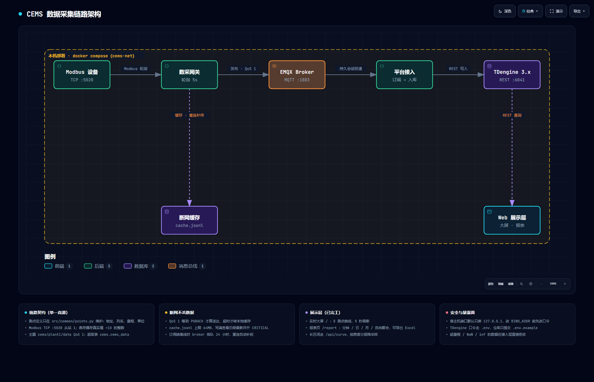

# CEMS 工业数据采集演示项目

模拟环保 CEMS 烟气在线监测数据采集全链路：仿真设备 → 网关 → MQTT Broker → 平台接入 → 时序库 → Web 实时大屏。



## 技术栈

- 设备协议：Modbus TCP（功能码 03 读保持寄存器）
- 消息队列：MQTT 3.1.1 + EMQX（Docker 部署）
- 时序数据库：TDengine 3.x（Docker 部署，taospy 连接）
- Web 后端：Flask
- 前端图表：ECharts

## 架构分层（数据流向：上 → 下）

### 1. 设备层 `src/device/modbus_server.py`
- 功能：模拟 CEMS 分析仪，Modbus TCP 服务端
- 寄存器（均放大10倍存整数）：地址0=SO2、地址1=NOx、地址2=Flow、地址3=颗粒物Dust、地址4=O2、地址5=温度Temp、地址6=湿度Humidity、地址7=压力Pressure
- 监听端口：5020

### 2. 网关层 `src/gateway/gateway.py`
- 功能：轮询读设备寄存器 → 换算真实值（÷10）→ 加时间戳 → MQTT 发布
- 发布主题：`cems/plant1/data`
- QoS：1
- 断网续传：本地 JSONL 缓存，重连后自动补传。缓存分两个文件、各有一个写者：
  - `data/cache.jsonl`——采集主循环追加写，放新数据
  - `data/cache.jsonl.sending`——补传线程持有，放在途批次
  两者用原子改名交接，所以补传期间新采的数据不会被覆盖；进程中途被杀也能接着补。
- 送达判定：QoS=1 必须等到 broker 的 **PUBACK** 才算送达（`publish()` 返回 `rc=0`
  只代表进了本机发送队列）。没等到 PUBACK 的数据一律转存缓存重试，不会静默丢弃。
- 补传节奏可用环境变量调：`PUBLISH_ACK_TIMEOUT`（单条确认超时）、
  `RESEND_WINDOW`（在途窗口条数）、`RESEND_RETRY_INTERVAL`（部分失败后的重试间隔）
- 断网缓存有容量上限（`CACHE_MAX_BYTES`，默认 64MB）：写满磁盘会让之后每条数据都丢，
  所以超限时按"丢最旧、保最新"裁剪并打 CRITICAL；写盘走 `flush + fsync`，
  进程被 kill 也不会丢尾部数据；启动时先校验 `data/` 可写
- 依赖：pymodbus、paho-mqtt

### 3. 平台接入层 `src/platform/subscriber_to_td.py`
- 功能：订阅 MQTT 主题 → 解析 9 个测点 → 写入 TDengine
- 会话持久化：默认使用**非干净会话**（`MQTT_CLEAN_SESSION=0`）配合固定的 client_id。
  订阅端离线期间，broker 会为 `cems/plant1/data` 上 QoS≥1 的消息排队，重连后自动补投。
  若不持久化（干净会话），离线期间发布的报文会被 broker 直接丢弃，且发布端拿到的是 PUBACK，
  看日志一切正常 —— 属于静默丢数据。
  - broker 侧上限（EMQX 默认值）：会话保留 `session_expiry_interval=2h`、离线队列 `max_mqueue_len=1000` 条，
    超出即丢最旧的；需要更长的断线容忍时间要改 EMQX 配置
  - 把 `MQTT_CLEAN_SESSION` 置 1 可退回"离线即丢"，仅用于对比演示
- TDengine 超级表：`cems.cems_data`（ts, so2, nox, flow, dust, o2, temp, humidity, pressure）
- 老库自动升级：启动时 DESCRIBE 超级表，缺哪列用 ALTER STABLE 补哪列
- 子表命名：`{厂区}_{设备}`（如 `plant1_device1`）。TDengine 对**已存在**的子表会沿用
  第一次写入的 TAGS 且不报错，若拿厂区名当子表名，接入第二台设备时数据会被静默
  挂到第一台的标签下；启动时还会核对该子表已有标签是否与配置一致
  （子表名统一转小写后比对：TDengine 表名不区分大小写，不归一化就会查不到行、静默跳过检查）
- 数值校验：每个测点先过 `math.isfinite()`（挡 NaN/inf）再过量程白名单
  （`POINT_RANGES`，挡负数和超量程）。任一测点不合格就整条拒收 —— 因为 NaN/inf 会让
  TDengine 报 syntax error，整行连其余 7 个正常测点一起丢，不如提前拦下。
  拒收条数会累计在日志里（`报文已拒收（累计 N 条）`）
- 启动自检：库名/表名/标签做标识符白名单校验（这些值会拼进 SQL），不合法直接拒绝启动
- 标签：plant, device
- 依赖：paho-mqtt、taospy

### 4. 展示层 `src/web/web_dashboard.py`
- 功能：Flask 后端 + ECharts 前端实时曲线（8 测点 / 3 组 Y 轴）
- 接口：`GET /api/data` 返回最近 10 分钟数据（JSON）
- 健康检查：`GET /api/health` 返回 Web 与 TDengine 是否都通
- 刷新：前端每 5 秒自动拉取
- 监听：0.0.0.0:5000（局域网可访问）
- 依赖：flask、taospy

## 方式零：一键启动（双击即可，就绪后自动打开浏览器）

**双击 `一键启动.bat`** 就行。脚本会：构建并启动 6 个容器 → 轮询 `http://localhost:5000/api/health`
→ **确认 Web 真的能响应之后**才打开浏览器（不是盲等几秒就开）。

失败时不再假装成功：会打印占用端口的进程、`docker compose logs` 排查命令；
Docker Desktop 没启动时会自动尝试拉起并等引擎就绪。

| 命令 | 作用 |
|---|---|
| `一键启动.bat` | 默认 Docker 模式：启动全部服务 + 打开大屏 |
| `一键启动.bat -Mode Local` | 本机模式：EMQX/TDengine 走容器，4 个服务用 4 个 Python 窗口（逐层看日志） |
| `一键启动.bat -NoBrowser` | 只启动服务，不打开浏览器 |
| `一键启动.bat -NoBuild` | 跳过镜像构建（改过 `src/` 代码时不要加） |
| `一键启动.bat -Stop` | 停止全部容器（数据卷保留，数据不丢） |
| `.\start.ps1 -DryRun` | 只打印将要执行的动作，不实际启动（排查用） |

说明：`.bat` 只是外壳，真正逻辑在 `start.ps1`（同为项目文件，可直接传参运行）。

## 方式一：Docker Compose 一键启动（推荐）

一条命令拉起 EMQX + TDengine + 四个服务，无需本地装 Python 环境：

```bash
docker compose up -d --build
```

第一次会构建镜像（装依赖），之后启动只要几秒。数据库初始化、建库建表、订阅、
采集全部自动完成，服务之间用健康检查排好启动顺序。

| 服务 | 容器名 | 地址 |
|---|---|---|
| MQTT Broker (EMQX) | emqx | `localhost:1883`，管理台 `localhost:18083` |
| 时序库 (TDengine) | tdengine | REST `localhost:6041` |
| 仿真设备 | cems-device | `localhost:5020` |
| 网关 | cems-gateway | — |
| 平台接入 | cems-subscriber | — |
| Web 大屏 | cems-web | `http://localhost:5000` |

### 端口暴露范围（默认只开本机）

所有端口默认只绑定 `127.0.0.1`，同网段的其它设备访问不到。原因很实际：
EMQX 的 1883 默认允许匿名发布（别人可以伪造数据）、18083 管理台默认 `admin/public`、
TDengine 6041 用的是演示口令 `root/taosdata`（可以读写删库）。绑到 `0.0.0.0`
等于把这三样一起交出去。

需要局域网看大屏时，在 `.env` 里改：

```ini
BIND_ADDR=0.0.0.0
```

**改完必须同时改掉 `TD_PASS` 和 EMQX 的默认口令**，否则就是上面那种情况。
`start.ps1` 在这种情况下会额外打一条告警。

常用命令：

```bash
docker compose ps                     # 看六个服务状态
docker compose logs -f gateway        # 跟踪某个服务日志
docker compose down                   # 停止（数据保留在具名卷里）
docker compose down -v                # 停止并连数据一起删
docker compose run --rm web python src/web/query_tool.py   # 在容器里核对入库情况
```

数据落地位置：TDengine 数据在具名卷 `cems-tdengine-data`，EMQX 在 `cems-emqx-data`，
网关断网缓存在宿主机的 `data/cache.jsonl`。

### 构建报 `auth.docker.io` 鉴权错误的处理

若 `docker compose up -d --build` 在最后一步报
`failed to fetch oauth token: ... auth.docker.io`，这是 Docker Desktop 开了
**containerd 镜像存储** + 该域名被 DNS 污染导致的（镜像其实已经构建出来了）。
两种解法：

```powershell
# 解法 A：改用传统构建器（推荐，一条命令）
$env:DOCKER_BUILDKIT=0; docker compose build; docker compose up -d
```

- 解法 B：Docker Desktop → Settings → General → 取消勾选
  "Use containerd for pulling and storing images"，重启 Docker Desktop 后重试。

## 方式二：本机直接运行（适合逐层调试）

先起依赖：`docker compose up -d emqx tdengine`，再开四个终端依次运行：

1. `python src/device/modbus_server.py` — 仿真设备
2. `python src/gateway/gateway.py` — 网关
3. `python src/platform/subscriber_to_td.py` — 平台接入（入库）
4. `python src/web/web_dashboard.py` — Web 大屏
5. 浏览器访问 `http://localhost:5000`（局域网：`http://<电脑IP>:5000`）

各服务的连接参数都在文件顶部配置区，且支持用环境变量覆盖
（如 `MQTT_HOST`、`TD_URL`），默认值就是本机 `localhost`，所以直接跑不用改代码。

## 辅助工具

- `src/web/query_tool.py` — 查询入库数据 + INTERVAL 时间聚合（运维排查用）
- `src/platform/subscriber.py` — 旧版订阅端（仅打印，已废弃）
- `docs/` — 架构复习图（HTML）

## 环境依赖

见 `requirements.txt`。Python 3.12。

> 注意：`pymodbus` 已锁到 `<3.9`。3.9 起官方把 `ModbusSlaveContext` 改名、
> 把 `slave=` 参数改成 `device_id=`，设备层会直接 ImportError。
